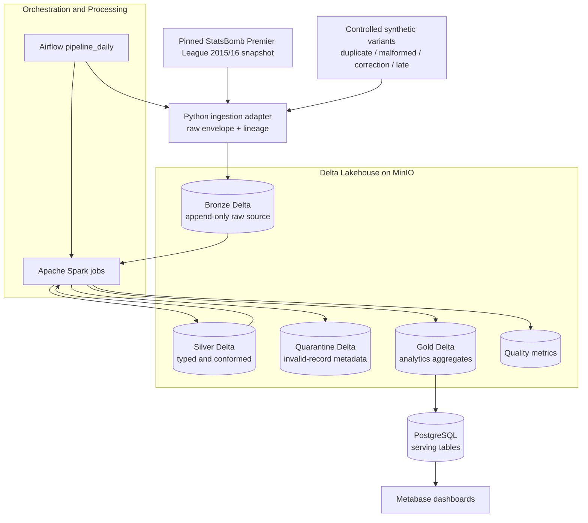

<div>
  
</div>

<div align="center">
  <strong>English</strong> | <a href="README_VI.md">Vietnamese</a>
</div>

<h3 align="center">Reliable Football Analytics Lakehouse with Bronze–Silver–Gold Delta Tables, Spark Data Quality, and PostgreSQL Serving</h3>

<div align="center">
  
  
  
  
  
  
</div>

---

## Table of Contents

1. [Project Overview](#project-overview)
2. [System Architecture & Data Flow](#system-architecture--data-flow)
3. [Core Features](#core-features)
4. [Validated Smoke Result](#validated-smoke-result)
5. [Tech Stack](#tech-stack)
6. [Directory Structure](#directory-structure)
7. [Quick Start Guide](#quick-start-guide)
8. [Storage, Outputs & Dashboards](#storage-outputs--dashboards)
9. [Monitoring & Troubleshooting](#monitoring--troubleshooting)
10. [Documentation](#documentation)

---

## Project Overview

PitchFlow is a local, Docker Compose football data lakehouse built to demonstrate reliable ELT rather than only happy-path analytics. It ingests a version-pinned StatsBomb Open Data Premier League 2015/16 snapshot (380 matches), preserves source payloads in an append-only Bronze layer, validates and conforms them with PySpark into Silver, builds Gold analytics aggregates, and publishes selected Gold datasets to PostgreSQL for Metabase.

The reliability design intentionally exercises upstream problems: exact duplicate events, malformed records, changed-payload corrections and late-arriving events. Invalid data is routed to Quarantine with a reference to its Bronze record; it is not silently discarded. `pipeline_run_id`, deterministic record IDs, Delta merges and PostgreSQL UPSERTs make retries and reruns safe.

This repository currently targets V1 with several reliability capabilities brought forward from the V2 roadmap. A detailed interview-oriented explanation is available in [docs/INTERVIEW_GUIDE.md](docs/INTERVIEW_GUIDE.md), and an operator runbook is available in [docs/RUN_GUIDE.md](docs/RUN_GUIDE.md).

## System Architecture & Data Flow

The platform is fully containerized. MinIO acts as the local S3-compatible object store for Delta tables; PostgreSQL is a serving projection, not the lakehouse source of truth.

### Ingestion, Transformation and Serving Pipeline



### Layer ownership

| Layer | Location | Purpose |
|---|---|---|
| Bronze | `s3a://pitchflow/bronze/*` | Raw payload, lineage, replay source; append-only |
| Silver | `s3a://pitchflow/silver/*` | Typed, validated, conformed and deduplicated entities |
| Quarantine | `s3a://pitchflow/quarantine/*` | Rejected-record metadata and Bronze references |
| Gold | `s3a://pitchflow/gold/*` | Match, team and event analytics aggregates |
| Operations | `s3a://pitchflow/ops/quality_metrics` | Per-run input, DQ, duplicate and late-event metrics |
| Serving | PostgreSQL `pitchflow` database | Dashboard-optimized Gold projection |

## Core Features

### 1. Reproducible source ingestion

The active source is pinned to StatsBomb Open Data commit `b0bc9f22dd77c206ddedc1d742893b3bbe64baec` for Premier League 2015/16 (`competition_id=2`, `season_id=27`). The URI, commit SHA, source object and retrieval metadata are persisted in Bronze. The prior World Cup profile remains available at `config/statsbomb_world_cup_2022.json`.

### 2. Reliable Bronze–Silver–Gold ELT

Raw JSON is loaded before business validation. Spark parses matches, lineups and events into typed Silver tables, then rebuilds only affected match/team aggregates in Gold. This preserves evidence and keeps transformations separate from orchestration.

### 3. Data-quality and Quarantine workflow

The pipeline checks required IDs, minute range, match/team relationships and duplicate/correction semantics. Invalid records retain `bronze_record_id`, failed rule, message, status, retry count and rule version in Quarantine. Quality metrics are persisted per `pipeline_run_id`.

### 4. Idempotent retries and reruns

Deterministic `bronze_record_id`, business-key Delta merges and PostgreSQL `ON CONFLICT` UPSERTs prevent duplicate business rows. Re-running a logical batch is an explicit smoke-test scenario.

### 5. Late-event and manual replay support

Valid events earlier than the existing Silver watermark are accepted with `is_late=true`; affected matches are rebuilt. V1 supports a focused manual replay from Bronze. A configurable Airflow replay DAG is planned for V2.

### 6. Controlled reliability testing

The synthetic generator derives variants from real valid events, so it tests failure handling without replacing the source dataset or fabricating unrelated football data.

## Validated Smoke Result

A Docker-backed smoke run successfully processed the pinned source with chaos variants:

| Metric | Result |
|---|---:|
| Input event rows | 3,393 |
| Valid event rows | 3,389 |
| Exact duplicates measured | 1 |
| Quarantined records | 3 |
| Late events | 0 in the validated batch |
| Rerun behavior | No duplicate Silver/Gold/serving business rows |

These values are evidence from the documented smoke run, not a fixed contract for every `match_limit` or source configuration.

## Tech Stack

### Processing and storage

- **Apache Spark 3.5.3**: distributed parsing, validation, deduplication and aggregation.
- **Delta Lake 3.2.0**: transactional table format and merge semantics on Parquet.
- **MinIO**: local S3-compatible object storage for all Delta layers.
- **Hadoop S3A**: Spark connector between the jobs and MinIO.

### Orchestration and serving

- **Apache Airflow 2.10.5**: `pipeline_daily` DAG with ingestion, transformation and publish dependencies.
- **PostgreSQL 16**: serving database for selected Gold datasets and Airflow/Metabase metadata databases.
- **Metabase 0.53.8**: dashboard and SQL exploration over PostgreSQL.
- **Docker Compose**: reproducible local service topology.

### Source and language

- **Python**: source adapter, deterministic envelopes, chaos variants and orchestration entry points.
- **StatsBomb Open Data**: pinned Premier League 2015/16 JSON snapshot (380 matches, event-level data).

## Directory Structure

```text
pitchflow-reliable-football-data-lakehouse/
├── airflow/dags/
│   └── pipeline_daily.py             # Airflow DAG: ingest -> Silver -> Gold -> serving
├── config/
│   ├── statsbomb_source.json         # Pinned source URI, commit and season manifest
│   └── chaos_variants.json           # Controlled variant configuration
├── docker/
│   ├── airflow/                      # Airflow image and Python dependencies
│   ├── postgres/init/                # Airflow, PitchFlow and Metabase databases
│   └── spark/                        # Spark image and Delta/S3A dependencies
├── ingestion/
│   ├── common/records.py             # SourceRecord, hashes and Bronze identity
│   ├── statsbomb/client.py           # Snapshot adapter
│   └── generator/chaos.py            # Duplicate/DQ/late variants
├── spark/
│   ├── common/                       # Runtime, schemas, Delta and Bronze helpers
│   └── jobs/
│       ├── ingest_raw.py             # Source -> Bronze
│       ├── bronze_to_silver.py       # Bronze -> Silver + DQ/Quarantine
│       └── silver_to_gold.py         # Silver -> Gold aggregates
├── serving/publish_postgres/
│   └── publish.py                    # Gold -> PostgreSQL UPSERT
├── docs/                             # PRD, architecture, DQ, runbook and interview guide
├── scripts/validate_project.py       # Harness validation
├── tests/                            # Unit and repository contract tests
├── docker-compose.yml                # Full local stack
├── .env.example                      # Safe configuration template
└── README.md                         # Project overview
```

## Quick Start Guide

### Step 1 — Prepare environment

Prerequisites: Docker Desktop with Linux containers, Docker Compose v2, and 6–8 GB Docker memory.

```powershell
Copy-Item .env.example .env
docker version
docker compose version
```

### Step 2 — Start services

```powershell
docker compose up --build -d
docker compose ps
```

The stack starts PostgreSQL, MinIO, Spark master/worker, Airflow init/webserver/scheduler and Metabase. `airflow-init` and `minio-init` may exit with code 0 after successful initialization.

### Step 3 — Unpause and trigger the DAG

The DAG starts paused intentionally:

```powershell
docker compose exec -T airflow-scheduler airflow dags unpause pipeline_daily
```

Open `http://localhost:8088`, select `pipeline_daily`, and trigger it with:

```json
{
  "match_limit": 2,
  "inject_chaos": true
}
```

Use `{ "inject_chaos": false }` for a normal snapshot run. Omit `match_limit` to process the full pinned snapshot.

### Step 4 — Validate result

Inspect task logs in Airflow, browse Delta objects in MinIO, and query PostgreSQL Gold tables as described in the [Run Guide](docs/RUN_GUIDE.md).

## Storage, Outputs & Dashboards

### Local endpoints

| Service | URL | Local credential/connection |
|---|---|---|
| Airflow | [localhost:8088](http://localhost:8088) | `airflow` / `airflow` |
| MinIO Console | [localhost:9001](http://localhost:9001) | `minioadmin` / `minioadmin` |
| Spark Master UI | [localhost:8080](http://localhost:8080) | No login |
| Metabase | [localhost:3000](http://localhost:3000) | Create admin account first time |

### Metabase PostgreSQL connection

From inside the Docker network use host `postgres`, not `localhost`:

```text
Host: postgres
Port: 5432
Database: pitchflow
User: pitchflow
Password: pitchflow
Schema: public
SSL: disabled for local development
```

For a client running on the host (for example DBeaver), use `localhost:5432` or `127.0.0.1:5432`.
Docker maps host port `5432` directly to container port `5432`.

### PostgreSQL serving tables

- `gold_match_summary`: one row per match with score, winner, shots, cards and event count.
- `gold_team_performance`: one row per team with matches, wins/draws/losses, goals and points.
- `gold_event_distribution`: event type by 15-minute bucket.

### Metabase Football Analytics Dashboard Preview

<div align="center">
  <a href="http://localhost:3000/public/dashboard/62fcdade1dd1122d03f804dde9fae39fff070b0c5874e94977442344005dca5f" target="_blank">
    
  </a>
  <p><em>Click image to open Metabase Public Dashboard (Requires local Metabase running)</em></p>
</div>

#### Live Public Embed Snippet
To embed the live Metabase dashboard into a web application:

```html
<iframe
    src="http://localhost:3000/public/dashboard/62fcdade1dd1122d03f804dde9fae39fff070b0c5874e94977442344005dca5f"
    frameborder="0"
    width="100%"
    height="800"
    allowtransparency>
</iframe>
```

### Data ownership

PostgreSQL contains only selected Gold serving data. The authoritative Bronze, Silver, Quarantine, Gold and quality-metric tables remain in MinIO Delta storage. Named Docker volumes are `minio-data`, `postgres-data` and `airflow-logs`.

## Monitoring & Troubleshooting

### Useful commands

```powershell
docker compose ps
docker compose logs --tail=200 airflow-scheduler
docker compose logs --tail=200 airflow-webserver
docker compose logs --tail=200 postgres
```

### Common issues

- **Docker API connection error:** open Docker Desktop and wait for the Linux engine to become ready.
- **DAG does not appear:** verify `airflow-scheduler` is running and the repository is mounted at `/opt/pitchflow`.
- **DAG is paused:** unpause `pipeline_daily`; pausing at creation is intentional.
- **Metabase cannot connect:** use hostname `postgres` inside Docker, database `pitchflow`, and confirm PostgreSQL is healthy.
- **Spark cannot read MinIO:** use endpoint `http://minio:9000`, bucket `pitchflow`, and confirm `minio-init` completed successfully.
- **Silver reports missing match reference:** ingest the matches object before processing events; do not skip the first DAG task on a fresh state.

For replay, reset behavior and detailed input/output examples, see [docs/RUN_GUIDE.md](docs/RUN_GUIDE.md).

## Documentation

- [PRD](docs/PitchFlow_PRD.md): product scope, architecture goals and V2/V3 roadmap.
- [Implementation plan](docs/IMPLEMENTATION_PLAN.md): locked V1 design decisions.
- [Architecture](docs/architecture.md): component boundaries, paths and invariants.
- [Data sources](docs/data-sources.md): source manifest and attribution.
- [DQ rules](docs/dq_rules.md): validation rules and actions.
- [Run Guide](docs/RUN_GUIDE.md): setup, inputs, outputs, replay and troubleshooting.
- [Interview Guide](docs/INTERVIEW_GUIDE.md): project explanation and interview Q&A.
- [Testing](docs/testing.md): supported validation and smoke-test expectations.

## Validation

```powershell
python -m unittest discover -s tests -v
python scripts/validate_project.py
docker compose config --quiet
git diff --check
```

## Data Attribution

StatsBomb Open Data is the V1 external source. Include the required StatsBomb attribution when publishing analysis or insights derived from this dataset.

---

<div>
  
</div>
