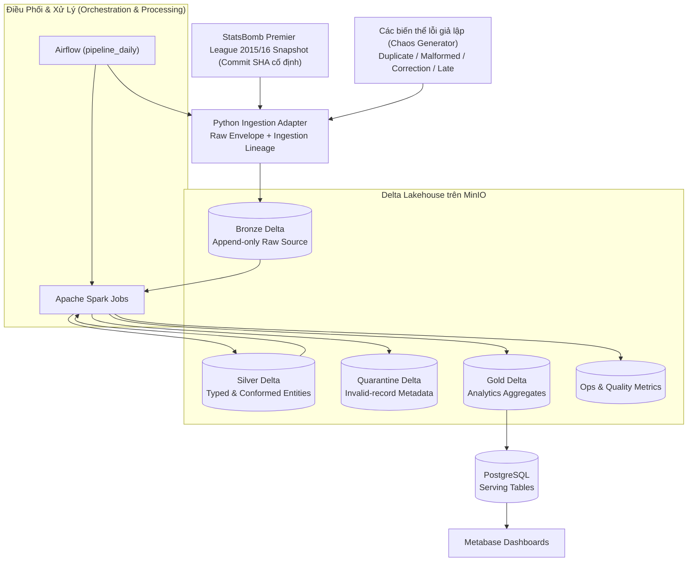
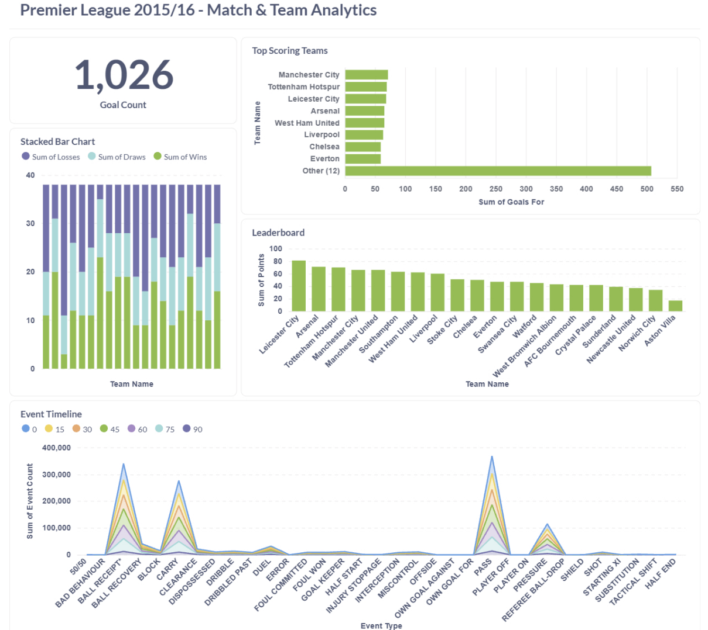

<div>
  
</div>

<div align="center">
  <a href="README.md">English</a> | <strong>Tiếng Việt</strong>
</div>

<h3 align="center">Hệ thống Football Analytics Data Lakehouse đáng tin cậy với kiến trúc Medallion (Bronze–Silver–Gold Delta Tables), PySpark Data Quality và PostgreSQL Serving Layer</h3>

<div align="center">
  
  
  
  
  
  
</div>

---

## Mục Lục

1. [Tổng Quan Dự Án](#tong-quan-du-an)
2. [Mô Tả Nguồn Dữ Liệu (Dataset Overview)](#mo-ta-nguon-du-lieu-dataset-overview)
3. [Kiến Trúc Hệ Thống & Luồng Dữ Liệu](#kien-truc-he-thong--luong-du-lieu)
4. [Điểm Nhấn Tính Năng](#diem-nhan-tinh-nang)
5. [Kết Quả Run Smoke Test Đã Kiểm Thử](#ket-qua-run-smoke-test-da-kiem-thu)
6. [Công Nghệ Sử Dụng](#cong-nghe-su-dung)
7. [Cấu Trúc Thư Mục](#cau-truc-thu-muc)
8. [Hướng Dẫn Khởi Chạy Nhanh](#huong-dan-khoi-chay-nhanh)
9. [Lưu Trữ, Dữ Liệu Đầu Ra & Dashboard](#luu-tru-du-lieu-dau-ra--dashboard)
10. [Giám Sát & Xử Lý Sự Cố](#giam-sat--xu-ly-su-co)
11. [Tài Liệu Chi Tiết](#tai-lieu-chi-tiet)

---

## Tổng Quan Dự Án

PitchFlow là một hệ thống Football Data Lakehouse chạy cục bộ trên môi trường Docker Compose, được thiết kế nhằm chứng minh tư duy xây dựng **ELT pipeline đáng tin cậy (Reliable ELT)** thay vị chỉ tập trung vào kịch bản lý tưởng (happy path). Hệ thống tự động thu thập dữ liệu nguồn được ghim phiên bản cố định từ StatsBomb Open Data (mặc định Premier League 2015/16 với 380 trận), lưu giữ nguyên bản payload thô ở tầng append-only Bronze, thực thi chuẩn hóa và kiểm tra chất lượng dữ liệu (DQ) bằng PySpark để đưa vào tầng Silver, xây dựng các bảng tổng hợp phân tích ở tầng Gold, và đồng bộ sang PostgreSQL cho Metabase hiển thị Dashboard.

Kiến trúc độ tin cậy của dự án chủ động giả lập các sự cố dữ liệu thực tế từ nguồn: trùng lặp sự kiện hoàn toàn (exact duplicates), dữ liệu lỗi định dạng (malformed records), hiệu chỉnh thay đổi nội dung (changed-payload corrections) và sự kiện đến muộn (late-arriving events). Bản ghi không hợp lệ được chuyển hướng sang tầng Quarantine kèm tham chiếu tới `bronze_record_id` thô ban đầu chứ không bị xóa bỏ âm thầm. Việc kết hợp giữa `pipeline_run_id`, định danh bản ghi xác định, Delta merge và PostgreSQL UPSERT giúp quy trình retry hoặc rerun đạt tính toàn vẹn và an toàn tuyệt đối (idempotency).

---

## Mô Tả Nguồn Dữ Liệu (Premier League Dataset Overview)

Dự án PitchFlow sử dụng bộ dữ liệu **Premier League 2015/16** đầy đủ từ kho lưu trữ mở của StatsBomb (nay thuộc Hudl). Đây là bộ dữ liệu bóng đá chuyên sâu tiêu chuẩn ngành, cung cấp thông tin chi tiết từ cấp trận đấu tới từng sự kiện diễn ra trên sân.

### 1. Thông Tin Nguồn & Đường Dẫn Trực Tiếp (Dataset Links)
* **Tên tập dữ liệu**: Premier League Mùa giải 2015/16 (`competition_id=2`, `season_id=27`).
* **Kho lưu trữ mã nguồn mở**: [StatsBomb Open Data Repository](https://github.com/statsbomb/open-data) (hoặc mirror tại [hudl/open-data](https://github.com/hudl/open-data)).
* **Link trực tiếp file trận đấu Premier League**: [Premier League 2015/16 Matches JSON (`data/matches/2/27.json`)](https://github.com/statsbomb/open-data/blob/master/data/matches/2/27.json).
* **Quy mô dữ liệu**: **380 trận đấu** (toàn bộ mùa giải Premier League 2015/16), bao gồm hàng triệu sự kiện chi tiết.
* **Mã Commit SHA ghim cố định (Version Pinning)**: `b0bc9f22dd77c206ddedc1d742893b3bbe64baec`. Việc ghim mã commit SHA giúp đảm bảo dữ liệu nguồn không bị thay đổi ngẫu nhiên, giúp quy trình nạp (Ingestion) và xử lý đạt tính **tái hiện (reproducibility)** 100%.
* **Cấu hình pipeline**: Lưu tại `config/statsbomb_source.json`.

### 2. Cấu Trúc File Nguồn JSON
* **`competitions.json`**: Danh mục các giải đấu và mùa giải bóng đá.
* **`matches/2/27.json`**: Danh sách chi tiết 380 trận đấu của Premier League 2015/16 (thông tin 2 đội, ngày giờ, tỷ số, trọng tài, sân vận động).
* **`lineups/{match_id}.json`**: Đội hình xuất phát, danh sách dự bị, vị trí và số áo của từng cầu thủ theo trận đấu.
* **`events/{match_id}.json`**: Dữ liệu sự kiện theo từng giây/phút trong trận (sút bóng, chuyền bóng, xoạc bóng, lừa bóng, thẻ phạt, bàn thắng, việt vị...).

---

## Kiến Trúc Hệ Thống & Luồng Dữ Liệu

Toàn bộ nền tảng được đóng gói hoàn chỉnh bằng Docker Containers. MinIO đóng vai trò là S3-compatible Object Store cục bộ lưu trữ các bảng Delta Lake; PostgreSQL chỉ đóng vai trò là tầng phục vụ truy vấn (Serving projection) cho Dashboard chứ không phải nguồn lưu trữ chính của Lakehouse.

### Sơ Đồ Quy Trình Nạp, Biến Đổi & Phục Vụ Dữ Liệu



### Phân Định Trách Nhiệm Các Tầng Dữ Liệu

| Tầng | Vị trí | Mục đích & Đặc điểm |
|---|---|---|
| **Bronze** | `s3a://pitchflow/bronze/*` | Lưu trữ payload thô, lineage và làm nguồn replay; thuộc tính Append-only |
| **Silver** | `s3a://pitchflow/silver/*` | Dữ liệu đã định kiểu (typed), kiểm định chất lượng, chuẩn hóa và khử trùng |
| **Quarantine** | `s3a://pitchflow/quarantine/*` | Lưu vết metadata của các bản ghi từ chối kèm tham chiếu tới Bronze |
| **Gold** | `s3a://pitchflow/gold/*` | Các bảng tổng hợp chỉ số phân tích trận đấu, đội bóng và phân bố sự kiện |
| **Operations** | `s3a://pitchflow/ops/quality_metrics` | Chỉ số DQ pass rate, số lượng duplicate/quarantine/late per batch run |
| **Serving** | PostgreSQL `pitchflow` database | Bảng phục vụ tối ưu cho Dashboard Metabase truy vấn |

---

## Điểm Nhấn Tính Năng

### 1. Nạp Dữ Liệu Nguồn Tái Đóng Băng (Reproducible Source Ingestion)
Nguồn dữ liệu thực tế được ghim cố định tại Premier League 2015/16 (`competition_id=2`, `season_id=27`) commit SHA `b0bc9f22dd77c206ddedc1d742893b3bbe64baec`. Tất cả thông tin URI, commit SHA, file thô và metadata nạp được lưu giữ trọn vẹn tại tầng Bronze.

### 2. Luồng ELT Chuẩn Medallion Phân Tầng An Toàn
Dữ liệu JSON thô được tải lên Bronze trước khi áp dụng bất kỳ logic kiểm tra nghiệp vụ nào. Spark tiến hành đọc Bronze, bóc tách danh sách trận đấu, đội hình và sự kiện vào các bảng Silver, sau đó tái tổng hợp các trận đấu/đội bóng bị ảnh hưởng ở tầng Gold. Quy trình này bảo toàn bằng chứng thô và tách biệt logic biến đổi khỏi luồng điều phối Airflow.

### 3. Quy Trình Kiểm Định Chất Lượng (DQ) & Quarantine Đa Chiều
Hệ thống tự động kiểm tra tính hợp lệ của các trường ID bắt buộc, khoảng phút thi đấu (0–130), mối quan hệ giữa các thực thể và ngữ nghĩa trùng lặp/hiệu chỉnh. Bản ghi lỗi giữ nguyên `bronze_record_id`, mã quy tắc thất bại, thông điệp lỗi, trạng thái và số lần retry trong Quarantine. Các chỉ số DQ metrics được lưu trữ theo từng `pipeline_run_id`.

### 4. Khả Năng Thử Lại (Retry) & Chạy Lại (Rerun) Đảm Bảo Idempotency
Nhờ sử dụng `bronze_record_id` xác định, thao tác Delta Merge dựa trên business keys và PostgreSQL `ON CONFLICT` UPSERT, việc chạy lại một batch dữ liệu hoàn toàn không làm phát sinh bản ghi trùng lặp trong dữ liệu phân tích.

### 5. Hỗ Trợ Sự Kiện Đến Muộn (Late-Event) & Quy Trình Replay
Các sự kiện hợp lệ đến sau thời gian Watermark đã ghi nhận ở Silver sẽ được tiếp nhận với đánh dấu `is_late=true`, đồng thời tự động kích hoạt tính toán lại chỉ số Gold cho các trận đấu tương ứng. Các bản ghi bị Quarantine có thể được replay qua Airflow DAG `pipeline_replay` hoặc phê duyệt qua `pipeline_resolve_correction`.

### 6. Giả Lập Lỗi Kiểm Thử Độ Tin Cậy Có Control (Chaos Testing)
Bộ sinh lỗi giả lập (`chaos generator`) tạo ra các biến thể dựa trên chính các sự kiện thật hợp lệ (thay vì tự sinh dữ liệu bóng đá giả), giúp kiểm thử chính xác khả năng chịu lỗi của pipeline.

---

## Kết Quả Run Smoke Test Đã Kiểm Thử

Số liệu thực tế từ một lượt chạy Smoke Test tích hợp trên Docker Compose kèm giả lập lỗi chaos:

| Chỉ số | Kết quả thực tế |
|---|---:|
| **Số sự kiện đầu vào (Input event rows)** | 3,393 |
| **Số sự kiện hợp lệ (Valid event rows)** | 3,389 |
| **Số sự kiện trùng lặp chính xác (Exact duplicates)** | 1 |
| **Số bản ghi bị chuyển sang Quarantine** | 3 |
| **Số sự kiện đến muộn (Late events)** | 0 (trong batch kiểm thử) |
| **Hành vi khi rerun cùng batch** | Không nhân đôi dữ liệu tại Silver/Gold/PostgreSQL |

---

## Công Nghệ Sử Dụng

### Xử Lý & Lưu Trữ (Processing & Storage)
* **Apache Spark 3.5.3**: Phân tích, chuẩn hóa, khử trùng và tổng hợp dữ liệu phân tán.
* **Delta Lake 3.2.0**: Định dạng bảng giao dịch ACID và thao tác Merge trên nền Parquet.
* **MinIO**: S3-compatible Object Storage cục bộ cho tất cả các tầng Delta.
* **Hadoop S3A**: Connector kết nối giữa Spark jobs và MinIO.

### Điều Phối & Phục Vụ (Orchestration & Serving)
* **Apache Airflow 2.10.5**: Quản lý các DAG `pipeline_daily`, `pipeline_replay` và `pipeline_resolve_correction`.
* **PostgreSQL 16**: Cơ sở dữ liệu phục vụ hiển thị Dashboard Gold tables và lưu trữ metadata.
* **Metabase 0.53.8**: Công cụ BI trực quan hóa chỉ số bóng đá.
* **Docker Compose**: Đóng gói và phối hợp toàn bộ hạ tầng dịch vụ cục bộ.

---

## Cấu Trúc Thư Mục

```text
pitchflow-reliable-football-data-lakehouse/
├── airflow/dags/
│   ├── pipeline_daily.py             # DAG chính: Ingest -> Silver -> Gold -> Serving
│   ├── pipeline_replay.py            # DAG replay bản ghi Bronze theo ID
│   └── pipeline_resolve_correction.py# DAG phê duyệt/từ chối bản ghi Quarantine
├── config/
│   ├── statsbomb_source.json         # Cấu hình nguồn Premier League 2015/16
│   ├── statsbomb_world_cup_2022.json # Cấu hình nguồn FIFA World Cup 2022
│   └── chaos_variants.json           # Cấu hình biến thể giả lập lỗi
├── docker/
│   ├── airflow/                      # Dockerfile & dependencies cho Airflow
│   ├── postgres/init/                # Scripts khởi tạo DB pitchflow, metabase
│   └── spark/                        # Dockerfile cho Spark Master/Worker + Delta JARs
├── ingestion/
│   ├── common/records.py             # Định nghĩa SourceRecord, hash payload & Bronze ID
│   ├── statsbomb/client.py           # Client tải dữ liệu StatsBomb Open Data
│   └── generator/chaos.py            # Bộ sinh lỗi giả lập (duplicate, malformed, late)
├── spark/
│   ├── common/                       # Module chung: reliability, watermarks, schemas
│   └── jobs/
│       ├── ingest_raw.py             # Nạp dữ liệu thô -> Bronze
│       ├── bronze_to_silver.py       # Xử lý Bronze -> Silver + DQ Check + Quarantine
│       └── silver_to_gold.py         # Tổng hợp Silver -> Gold aggregates
├── serving/publish_postgres/
│   └── publish.py                    # Đồng bộ Gold Delta -> PostgreSQL UPSERT
├── docs/                             # Tài liệu PRD, Architecture, DQ rules, Run Guide & Dashboard Guide
├── scripts/validate_project.py       # Script kiểm tra hợp lệ codebase & harness
├── tests/                            # Unit tests & kiểm thử tích hợp
├── docker-compose.yml                # Cấu hình khởi chạy toàn bộ hệ thống
├── .env.example                      # Mẫu biến môi trường an toàn
├── README.md                         # Tài liệu tiếng Anh
└── README_VI.md                      # Tài liệu tiếng Việt (file này)
```

---

## Hướng Dẫn Khởi Chạy Nhanh

### Bước 1 — Chuẩn bị môi trường
Yêu cầu: Đã bật Docker Desktop (Linux containers), Docker Compose v2, tối thiểu 6–8 GB RAM khả dụng.

```powershell
Copy-Item .env.example .env
docker version
docker compose version
```

### Bước 2 — Khởi chạy các dịch vụ Docker
```powershell
docker compose up --build -d
docker compose ps
```
*Lưu ý: Container `airflow-init` và `minio-init` sẽ hoàn thành nhiệm vụ và thoát với code 0.*

### Bước 3 — Unpause và Trigger DAG
Mặc định DAG được tạo ở trạng thái Paused để tránh tự nạp dữ liệu khi khởi động:

```powershell
docker compose exec -T airflow-scheduler airflow dags unpause pipeline_daily
```

Truy cập Airflow UI tại `http://localhost:8088`, chọn `pipeline_daily` và kích hoạt với config:

```json
{
  "match_limit": 2,
  "inject_chaos": true
}
```

*Dùng `{ "inject_chaos": false }` nếu muốn chạy dữ liệu chuẩn. Bỏ `match_limit` để nạp toàn bộ 380 trận.*

### Bước 4 — Kiểm tra kết quả
Theo dõi log các task trong Airflow, duyệt các file Delta trên MinIO Console (`http://localhost:9001`) và truy vấn bảng PostgreSQL theo hướng dẫn tại [docs/RUN_GUIDE.md](docs/RUN_GUIDE.md).

---

## Lưu Trữ, Dữ Liệu Đầu Ra & Dashboard

### Địa Chỉ Địa Phương Các Dịch Vụ

| Dịch vụ | URL | Credential / Thông tin kết nối |
|---|---|---|
| **Airflow UI** | [localhost:8088](http://localhost:8088) | `airflow` / `airflow` |
| **MinIO Console** | [localhost:9001](http://localhost:9001) | `minioadmin` / `minioadmin` |
| **Spark Master UI** | [localhost:8080](http://localhost:8080) | Không cần đăng nhập |
| **Metabase BI** | [localhost:3000](http://localhost:3000) | Tạo tài khoản admin lần đầu truy cập |

### Thông Số Kết Nối PostgreSQL Từ Metabase

Khi kết nối từ bên trong mạng Docker (form cài đặt Metabase), sử dụng hostname `postgres`:

```text
Host: postgres
Port: 5432
Database: pitchflow
User: pitchflow
Password: pitchflow
Schema: public
SSL: disabled
```

Đối với các ứng dụng client chạy ngoài Docker trên máy host (như DBeaver), kết nối qua `localhost:5432` hoặc `127.0.0.1:5432`.

### Danh Sách Bảng Phục Vụ Phân Tích (PostgreSQL Gold Tables)
- `gold_match_summary`: Thông tin tổng quan từng trận đấu (tỷ số, đội thắng, cú sút, thẻ phạt, tổng số sự kiện).
- `gold_team_performance`: Chỉ số hiệu suất đội bóng (số trận, thắng/hòa/thua, bàn thắng/bàn thua, điểm số).
- `gold_event_distribution`: Thống kê phân bố các loại sự kiện theo từng khung giờ 15 phút.

### Giao Diện Metabase Dashboard Mẫu & Mã Nhúng

<div align="center">
    
</div>

---

## Giám Sát & Xử Lý Sự Cố

### Lệnh Xem Logs Nhanh
```powershell
docker compose ps
docker compose logs --tail=200 airflow-scheduler
docker compose logs --tail=200 postgres
```

### Các Sự Cố Thường Gặp
* **Không kết nối được Docker Daemon**: Mở ứng dụng Docker Desktop và chờ engine sẵn sàng.
* **DAG không xuất hiện trên Airflow UI**: Kiểm tra container `airflow-scheduler` đã Up và mã nguồn đã được mount tại `/opt/pitchflow`.
* **Metabase không truy vấn được DB**: Đảm bảo dùng host `postgres` (không dùng `localhost`) khi điền form cài đặt trong Metabase.
* **Spark không đọc được MinIO**: Xác nhận `PITCHFLOW_MINIO_ENDPOINT=http://minio:9000` và bucket `pitchflow` đã được khởi tạo bởi `minio-init`.

---

## Tài Liệu Chi Tiết

* [PRD (PitchFlow_PRD.md)](docs/PitchFlow_PRD.md): Yêu cầu sản phẩm, mục tiêu kiến trúc và lộ trình V2/V3.
* [Implementation Plan](docs/IMPLEMENTATION_PLAN.md): Các quyết định thiết kế đã chốt cho V1 & V2.
* [Architecture (architecture.md)](docs/architecture.md): Sơ đồ thành phần, luồng phụ thuộc và invariants.
* [Data Sources (data-sources.md)](docs/data-sources.md): Chi tiết nguồn dữ liệu StatsBomb và quy ước bản quyền.
* [DQ Rules (dq_rules.md)](docs/dq_rules.md): Danh mục quy tắc kiểm định chất lượng và ngưỡng cảnh báo.
* [Run Guide (RUN_GUIDE.md)](docs/RUN_GUIDE.md): Sổ tay vận hành, nạp dữ liệu, replay và khắc phục lỗi.
* [Dashboard Guide (METABASE_DASHBOARD_GUIDE.md)](docs/METABASE_DASHBOARD_GUIDE.md): Hướng dẫn chi tiết tạo Dashboard trên Metabase.
* [Interview Guide (INTERVIEW_GUIDE.md)](docs/INTERVIEW_GUIDE.md): Bộ câu hỏi và cách giải thích kiến trúc dự án khi phỏng vấn.
* [Testing Guide (testing.md)](docs/testing.md): Hướng dẫn chạy Unit test và Integration Smoke test.

---

## Kiểm Thử & Validation Codebase

```powershell
python -m unittest discover -s tests -v
python scripts/validate_project.py
docker compose config --quiet
git diff --check
```

---

## Bản Quyền Dữ Liệu (Attribution)

Dữ liệu được sử dụng từ **StatsBomb Open Data**. Mọi trích dẫn hoặc công bố phân tích phát sinh từ dự án này cần tuân thủ điều khoản sở hữu trí tuệ và ghi nhận nguồn của StatsBomb.

---

<div>
  
</div>
